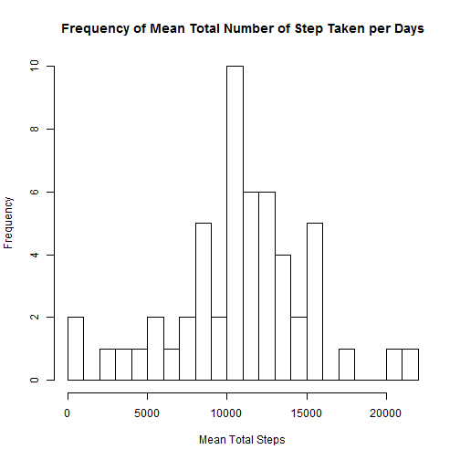
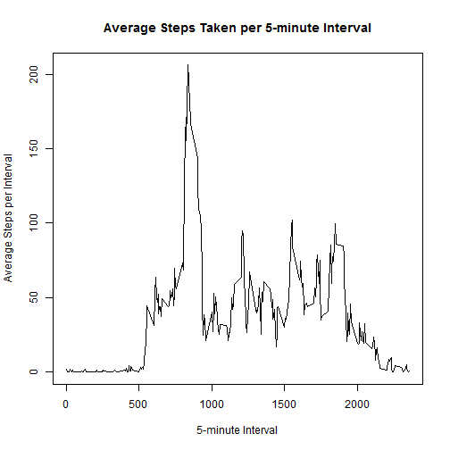
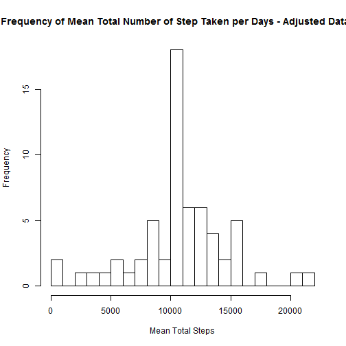
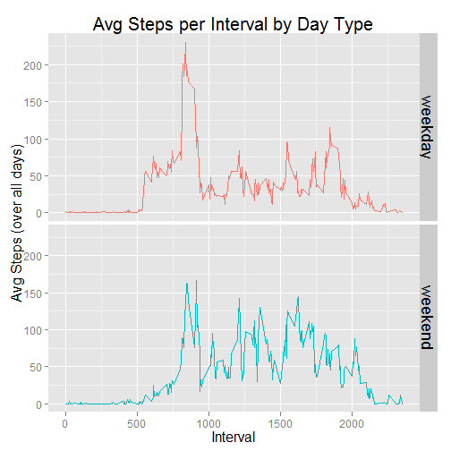

## Reproducible Research: Peer Assessment 1
### Coursera - Reproducible Research 

### Loading and preprocessing the data
Start off by loading any required libraries that will be needed; set the working directory for the assignment; download, unzip and load the data file into memory.


```r
library(knitr)
library(ggplot2)
setwd("C:/Users/TCarroll/Documents/GitHub/RepData_PeerAssessment1")
setInternet2(use = TRUE)
fileURL <- "https://d396qusza40orc.cloudfront.net/repdata%2Fdata%
2Factivity.zip"
download.file(fileURL,destfile = "repdata_data_activity.zip")
unzip("repdata_data_activity.zip")
activity.data.raw <- read.csv("activity.csv")
```

Process the raw data file for analysis performed below.  

- Convert date variable to date class  
- Add variable to identify the day of the week (Mon, Tue, etc.)  
- Add variable to identify the type of day (Weekday, Weekend)   


```r
activity.data <- activity.data.raw
activity.data$date <- as.Date(activity.data$date)
weekday <- c("Mon", "Tue", "Wed", "Thu", "Fri")
weekend <- c("Sat", "Sun")
activity.data$day.name <- weekdays(activity.data$date, abbreviate = TRUE)
activity.data$day.type <- ifelse(activity.data$day.name
                                 %in% weekday, "weekday", "weekend")
```

### What is mean total number of steps taken per day?

To determine the mean total number of steps taken per day, aggregate the data by the date variable and apply the mean function to the steps variable. Create a histogram from the aggregated data.


```r
steps.date.total <-
  aggregate(activity.data$steps, by = list(activity.data$date), FUN = sum)

names(steps.date.total) <- c("Date","Total.Steps")
hist(steps.date.total$Total.Steps, breaks = 20, main = "Frequency of Mean Total Number of Step Taken per Days", xlab = "Mean Total Steps")
```

 

Find mean and median number of steps using the mean & median functions.  

- Formula for mean total number of steps taken per day:  

```r
mean(steps.date.total$Total.Steps, na.rm = TRUE) 
```

    Mean total number of steps taken per day is 1.0766 &times; 10<sup>4</sup>

- Formula for median total number of steps taken per day:

```r
median(steps.date.total$Total.Steps, na.rm = TRUE)
```

    Median total number of steps taken per day is 10765


### What is the average daily activity pattern?

Create a line plot of average steps taken versus interval. Aggregate the data by the interval variable and apply the mean function to the steps variable.


```r
steps.interval.avg <-
  aggregate(activity.data$steps, by = list(activity.data$interval),
            FUN = mean, na.rm = TRUE)
names(steps.interval.avg) <- c("Interval","Avg.Steps")

plot(steps.interval.avg$Interval,steps.interval.avg$Avg.Steps, type = "l",
    main = "Average Steps Taken per 5-minute Interval",
    xlab = "5-minute Interval",
    ylab = "Average Steps per Interval")
```

 

The 5-minute interval, on average over all of the days in the data set, containing the maximum number of steps can be found by using the which.max function:


```r
interval.maxAvgSteps <- steps.interval.avg[which.max(steps.interval.avg$Avg.Steps),]
interval.maxAvgSteps
```

```
##     Interval Avg.Steps
## 104      835     206.2
```

### Imputing missing values

Find this value by using the is.na function:  

```r
sum(is.na(activity.data.raw$steps))
```

The number of missing values in the steps variable is 2304

Use the average number of steps taken for any individual interval (taken over all days in the data set) to replace a NA value for for the same interval.


```r
activity.data.adjusted <- activity.data
temp.01 <-activity.data[,1:3]
temp.02 <- cbind(temp.01, steps.interval.avg$Avg.Steps)
names(temp.02)[4] <- "Avg.Steps"
temp.03 <- ifelse(is.na(temp.02$steps), temp.02$Avg.Steps,temp.02$steps)
activity.data.adjusted$steps <- temp.03
```

Using the adjusted data set, create a histogram of the total number of steps taken each day.


```r
adjustedSteps.date.total <-
  aggregate(activity.data.adjusted$steps, by = list(activity.data.adjusted$date), FUN = sum)

names(adjustedSteps.date.total) <- c("Date","Total.Steps")
hist(adjustedSteps.date.total$Total.Steps, breaks = 20,
     main = "Frequency of Mean Total Number of Step Taken per Days - Adjusted Dataset",
     xlab = "Mean Total Steps")
```

 

Find mean and median number of steps using the mean & median functions.  
For the Adjusted data set  

- Formula for mean total number of steps taken per day:  

```r
mean(steps.date.total$Total.Steps, na.rm = TRUE)
```

    Mean total number of steps taken per day - adjusted data set - is 1.0766 &times; 10<sup>4</sup>

- Formula for median total number of steps taken per day:

```r
median(steps.date.total$Total.Steps, na.rm = TRUE)
```

    Median total number of steps taken per day - adjusted data set - is 10765

The values for the mean and median estimated for the adjusted data set (NAs replaced) do not differ from the estimates for the original data set:  
Original data set  

- Mean total number of steps taken per day - original data set - is 1.0766 &times; 10<sup>4</sup>

- Median total number of steps taken per day - original data set - is 10765


### Are there differences in activity patterns between weekdays and weekends?
Utilize the day.type variable added to the data set at the beginning of this assignment to separate the data by weekday and weekend day types.

Create a panel plot of average number of steps taken versus 5-minute interval using the ggplot2 package.

First aggregate the data by interval and day type and use the mean function. Then plot the aggregated data.


```r
adjustedSteps.interval.avg <-
  aggregate(activity.data.adjusted$steps,
            by = list(interval = activity.data.adjusted$interval,
                      day.type = activity.data.adjusted$day.type),
            FUN = mean, na.rm = TRUE)
names(adjustedSteps.interval.avg)[3] <- "Avg.Steps"

g <- ggplot(adjustedSteps.interval.avg, aes(interval, Avg.Steps)) +
  geom_line(aes(color = day.type)) + guides(color = FALSE, size = 11)
g <- g  + facet_grid(day.type ~ .)
g <- g + theme(axis.text = element_text(size = 12)) +
  theme(plot.title = element_text(size = 20),
        axis.title.x = element_text(size = 16),
        axis.title.y = element_text(size = 16)) +
  theme(strip.text.y = element_text(size = 18)) +
  ylab("Avg Steps (over all days)") +
  xlab("Interval") + ggtitle("Avg Steps per Interval by Day Type")
plot(g)
```

 


